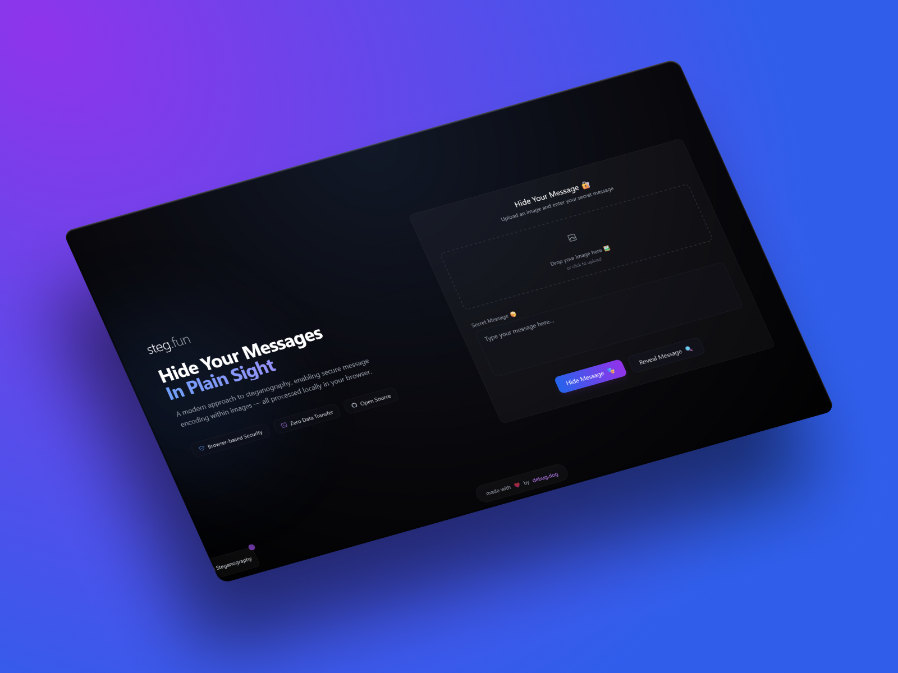

<div align="center">
  
  
  # ✨ steg.fun
  ### Hide Your Messages in Plain Sight 🔐
  
  <a href="https://steg.fun">Live Demo</a> • 
  <a href="#-features">Features</a> • 
  <a href="#-quick-start">Quick Start</a> • 
  <a href="#-how-it-works">How It Works</a>

  <br/>

  [](LICENSE)
  
  [](https://steg.fun)
</div>

## 🌟 Features

- 🔒 **Secure Browser-Based Processing** - All operations happen locally in your browser
- 🚫 **Zero Data Transfer** - Your images and messages never leave your device
- 🎨 **Modern UI/UX** - Beautiful, responsive design with smooth animations
- 🔍 **Easy to Use** - Simple drag-and-drop interface for image uploads
- 📱 **Mobile Friendly** - Works great on all devices

## 🚀 Quick Start

Visit [steg.fun](https://steg.fun) and start hiding messages! Or run it locally:

```bash
# Clone the repository
git clone https://github.com/debugdotdog/steg.fun

# Start with Docker
docker-compose up -d

# Visit http://localhost:8000
```

## 🔍 How It Works

steg.fun uses LSB (Least Significant Bit) steganography to hide messages in images:

1. 📸 Upload any image
2. ✍️ Type your secret message
3. 🎭 Click "Hide Message"
4. 📥 Download your encoded image
5. 🔓 Share it with anyone who needs to read the hidden message

The changes to the image are imperceptible to the human eye, but contain your secret message!

## 🛡️ Security Note

- All processing happens locally in your browser
- No data is ever transmitted to any server
- Images and messages stay on your device
- For sensitive data, consider additional encryption

## 🔧 Development

### Prerequisites

- Docker
- Docker Compose

### Local Setup

1. Clone the repository:
```bash
git clone https://github.com/debugdotdog/steg.fun
```

2. Start the development server:
```bash
docker-compose up -d
```

3. Visit http://localhost:8000 in your browser

## 🤝 Contributing

Contributions are welcome! Here's how you can help:

- 🐛 Report bugs
- 💡 Suggest features
- 🔧 Submit pull requests
- 📚 Improve documentation

Please read our Contributing Guidelines before making a pull request.

## 📝 License

This project is licensed under the MIT License - see the LICENSE file for details.

## 👋 Author

Made with ❤️ by [debug.dog](https://debug.dog)

---

<div align="center">
  <sub>Built with 🌟 by the community, for the community</sub>
</div>